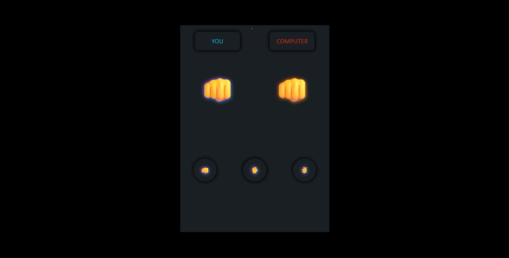

# Stone Paper Scissors Game

A simple Stone Paper Scissors game where users play against the computer with instant results.

## About

This is a browser-based Stone Paper Scissors game built using HTML, CSS, and JavaScript.  
The user selects Stone, Paper, or Scissors, and the computer randomly chooses one option.  
The result (win, lose, or draw) is displayed instantly.  
I built this project to practice conditional logic, random number generation, and updating the UI dynamically using JavaScript.

## Built With

`HTML` `CSS` `JavaScript`

## What I Learned

- How to implement game logic using conditions and random choices, and update the UI based on user actions.

## Links

- [Live Demo](https://snehashrestha123.github.io/stone-paper-scissors/ )
- [Source Code](https://github.com/Snehashrestha123/stone-paper-scissors)
